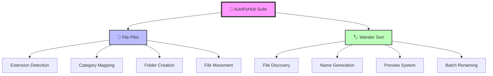
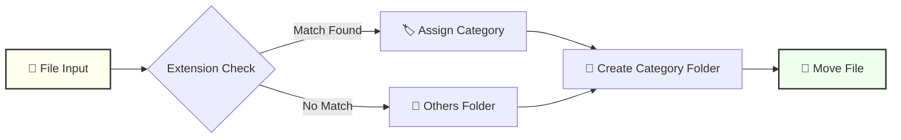
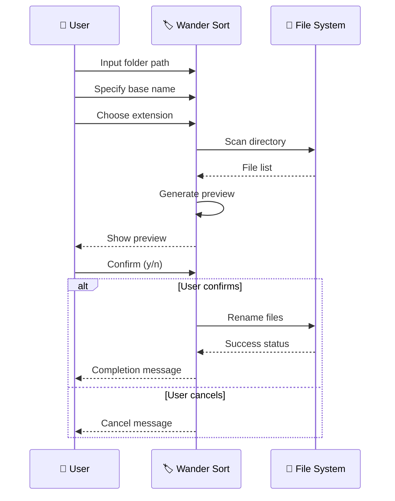

# 🚀 AutoPyHub

<div align="center">

[](https://www.python.org/downloads/)
[](https://opensource.org/licenses/MIT)
[](https://www.python.org/)
[](https://www.python.org/dev/peps/pep-0008/)

**🤖 Intelligent File Management Automation Suite**

*Streamline your file organization with intelligent sorting and batch renaming capabilities*

</div>

---

## 📋 Table of Contents

- [🌟 Overview](#-overview)
- [🏗️ Architecture](#️-architecture)
- [🔧 Core Components](#-core-components)
- [📁 File Organization System](#-file-organization-system)
- [🔄 Batch Renaming Engine](#-batch-renaming-engine)
- [💾 Data Flow & Interactions](#-data-flow--interactions)
- [🎯 Key Features](#-key-features)
- [📊 File Categories](#-file-categories)
- [🎮 User Interface Flow](#-user-interface-flow)
- [🔍 Code Examples](#-code-examples)
- [⚡ Performance Features](#-performance-features)

---

## 🌟 Overview

**AutoPyHub** is a powerful Python-based file management automation suite designed to simplify and streamline file organization tasks. The project consists of two main modules that work together to provide comprehensive file management solutions:

- **📁 File Pilot**: Intelligent file sorting and categorization
- **🏷️ Wander Sort**: Batch file renaming with preview capabilities

### 🎯 Mission
Transform chaotic file directories into organized, systematically structured folders with minimal user intervention.

---

## 🏗️ Architecture

```
AutoPyHub/
├── 📄 00_file_pilot.py          # File sorting & categorization engine
├── 📄 01_wander_sort.py         # Batch renaming utility
└── 📁 .venv/                    # Python virtual environment
```

### 🏛️ System Architecture

<div align="center">



</div>

---

## 🔧 Core Components

### 📁 File Pilot Module (`00_file_pilot.py`)

**Purpose**: Automatically organizes files into categorized folders based on file extensions

#### 🔑 Key Functions

| Function | Purpose | Input | Output |
|----------|---------|--------|---------|
| `get_destination_folder()` | Maps file extensions to categories | Filename (str) | Category folder name (str) |
| `sort_files()` | Main sorting orchestrator | Folder path (str) | Organized file structure |

#### 📋 Extension Mapping System

```python
EXTENSION_MAP = {
    "PDFs": [".pdf"],
    "Word Docs": [".docx"],
    "Excel Sheets": [".xlsx"],
    "PowerPoint Presentations": [".pptx"],
    "Images": [".jpg", ".jpeg", ".png", ".gif", ".bmp"],
    "Videos": [".mp4", ".avi", ".mov", ".wmv"],
    "Audio Files": [".mp3", ".wav", ".aac", ".flac"],
    "Archives": [".zip", ".rar", ".7z"],
    "Text Files": [".txt"],
    "Code Files": [".py", ".java", ".cpp", ".html", ".css", ".js"],
    # ... and more
}
```

### 🏷️ Wander Sort Module (`01_wander_sort.py`)

**Purpose**: Provides intelligent batch file renaming with preview functionality

#### 🔑 Key Functions

| Function | Purpose | Input | Output |
|----------|---------|--------|---------|
| `batch_rename()` | Batch renaming orchestrator | folder, base_name, extension | Renamed files with confirmation |

---

## 📁 File Organization System

### 🎯 Categorization Logic

<div align="center">



</div>

### 📊 Supported File Categories

| 📁 Category | 🔤 Extensions | 🎯 Use Case |
|-------------|---------------|-------------|
| **Documents** | `.pdf`, `.docx`, `.xlsx`, `.pptx` | Office files, reports |
| **Media** | `.jpg`, `.png`, `.mp4`, `.mp3` | Photos, videos, audio |
| **Development** | `.py`, `.java`, `.html`, `.css` | Source code files |
| **Archives** | `.zip`, `.rar`, `.7z` | Compressed files |
| **System** | `.dll`, `.exe`, `.sys` | Windows system files |
| **Others** | *Unmatched extensions* | Miscellaneous files |

---

## 🔄 Batch Renaming Engine

### 🎮 Workflow Process

<div align="center">



</div>

### 🔧 Renaming Pattern

```
Original: photo_001.jpg, photo_002.jpg, photo_003.jpg
Base Name: vacation
Result: vacation_1.jpg, vacation_2.jpg, vacation_3.jpg
```

---

## 💾 Data Flow & Interactions

### 🌊 File Pilot Data Flow

```
User Input → Path Validation → File Discovery → Extension Analysis → 
Category Assignment → Folder Creation → File Movement → Success Feedback
```

### 🌊 Wander Sort Data Flow

```
User Input → Directory Scanning → File Filtering → Name Generation → 
Preview Display → User Confirmation → Batch Renaming → Completion Report
```

---

## 🎯 Key Features

### 🌟 File Pilot Features

- ✅ **Intelligent Categorization**: 16 predefined file categories
- ✅ **Safe Operation**: Non-destructive file moving
- ✅ **Auto-folder Creation**: Creates missing directories automatically
- ✅ **Progress Feedback**: Real-time operation status
- ✅ **Unicode Support**: Handles international filenames
- ✅ **Cross-platform**: Works on Windows, Linux, and macOS

### 🌟 Wander Sort Features

- ✅ **Preview System**: See changes before applying
- ✅ **Extension Filtering**: Target specific file types
- ✅ **Sequential Naming**: Automatic numbering system
- ✅ **User Confirmation**: Safety mechanism prevents accidents
- ✅ **Case-insensitive**: Handles mixed-case extensions
- ✅ **Error Handling**: Graceful failure with informative messages

---

## 📊 File Categories

### 📋 Complete Extension Mapping

| 🏷️ Category | 🔤 Supported Extensions |
|-------------|-------------------------|
| **PDFs** | `.pdf` |
| **Word Docs** | `.docx` |
| **Excel Sheets** | `.xlsx` |
| **PowerPoint** | `.pptx` |
| **Images** | `.jpg`, `.jpeg`, `.png`, `.gif`, `.bmp` |
| **Videos** | `.mp4`, `.avi`, `.mov`, `.wmv` |
| **Audio** | `.mp3`, `.wav`, `.aac`, `.flac` |
| **Archives** | `.zip`, `.rar`, `.7z` |
| **Text** | `.txt` |
| **Code** | `.py`, `.java`, `.cpp`, `.html`, `.css`, `.js` |
| **Spreadsheets** | `.xls` |
| **Presentations** | `.ppt` |
| **Databases** | `.db`, `.sqlite` |
| **Config** | `.ini`, `.cfg` |
| **Logs** | `.log` |
| **System** | `.dll`, `.sys` |
| **Executables** | `.exe` |

---

## 🎮 User Interface Flow

### 🖥️ Command Line Interface

Both modules feature **interactive command-line interfaces** with:

- 📍 **Smart Defaults**: Current directory as default path
- ❓ **Input Validation**: Path verification and error handling
- 📊 **Progress Indicators**: Visual feedback during operations
- ✅ **Completion Messages**: Success/failure notifications

### 🎲 Interaction Examples

#### File Pilot Usage
```
Enter the folder path or leave empty to use current folder: 📁
📁 Moved: report.pdf to PDFs
📁 Moved: photo.jpg to Images
📁 Moved: song.mp3 to Audio Files
✅ Files sorted successfully.
```

#### Wander Sort Usage
```
Enter the folder path or leave empty to use current folder: 📁
Enter the base name for renaming: vacation
Enter the file extension to filter (e.g., .jpg, .png): .jpg
Renamed: IMG_001.jpg to vacation_1.jpg
Renamed: IMG_002.jpg to vacation_2.jpg
Are you sure you want to rename all files? (y/n): y
✅ Batch rename completed.
```

---

## 🔍 Code Examples

### 📁 File Pilot - Core Logic

```python
def get_destination_folder(filename):
    """
    Determines the destination folder for a file based on its extension.
    
    Args:
        filename (str): The name of the file to categorize.
    
    Returns:
        str: The folder name from EXTENSION_MAP, or 'Others' if no match.
    """
    ext = os.path.splitext(filename)[1].strip().lower()
    for folder, extensions in EXTENSION_MAP.items():
        if ext in extensions:
            return folder
    return "Others"
```

### 🏷️ Wander Sort - Preview System

```python
# Preview the new filenames without actually renaming
for i, file in enumerate(files, start=1):
    new_name = f"{base_name}_{i}{extension}"
    print(f"Renamed: {file} to {new_name}")

# Ask user for confirmation before performing the actual rename
confirm = input("Are you sure you want to rename all files? (y/n): ").strip().lower()
```

---

## ⚡ Performance Features

### 🚀 Optimization Strategies

- **🎯 Targeted Operations**: Only processes specified file types
- **💾 Memory Efficient**: Processes files one at a time
- **⚡ Fast Extension Matching**: Dictionary-based lookup system
- **🔄 Safe File Operations**: Uses atomic move operations
- **🛡️ Error Recovery**: Continues operation on individual file failures

### 📈 Performance Characteristics

| Operation | Time Complexity | Space Complexity |
|-----------|-----------------|------------------|
| File Categorization | O(n × m) | O(1) |
| Batch Renaming | O(n) | O(n) |
| Directory Scanning | O(n) | O(n) |

*Where n = number of files, m = number of extension categories*

---

<div align="center">

## 🎉 **AutoPyHub** - Your Intelligent File Management Companion

**🚀 Ready to transform your chaotic folders into organized masterpieces!**

</div>

---

<div align="center">

### 🔗 **Built with Python Excellence**

[](https://www.python.org/)
[](https://www.python.org/)
[](https://www.python.org/)

</div>